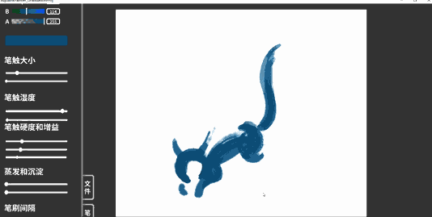
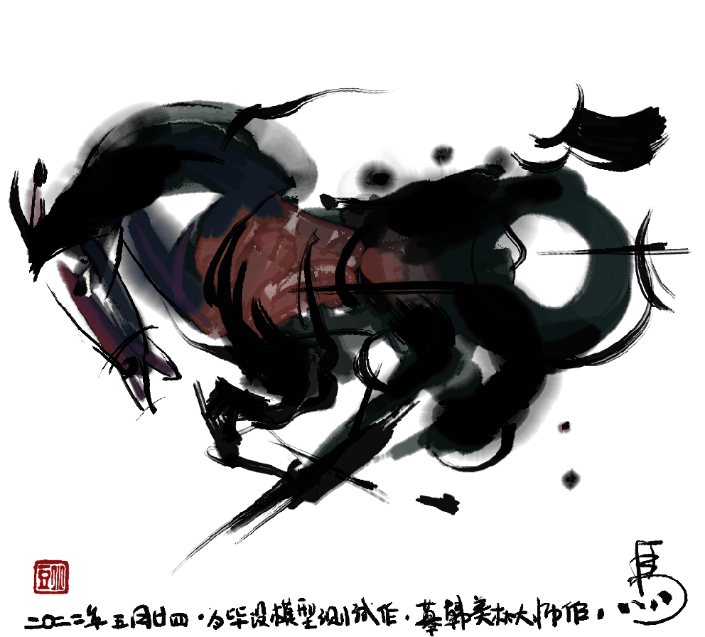
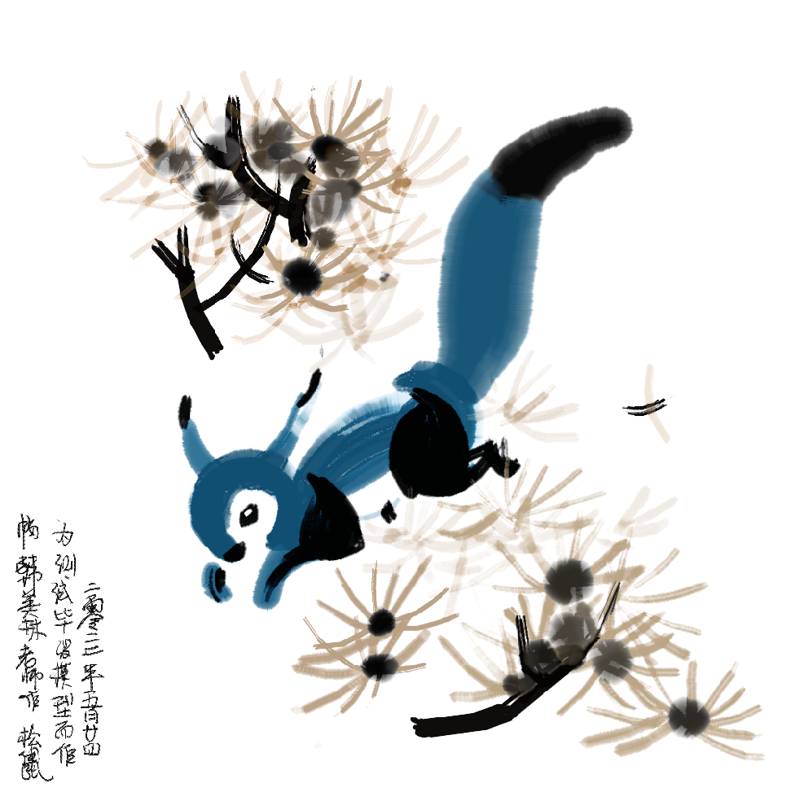
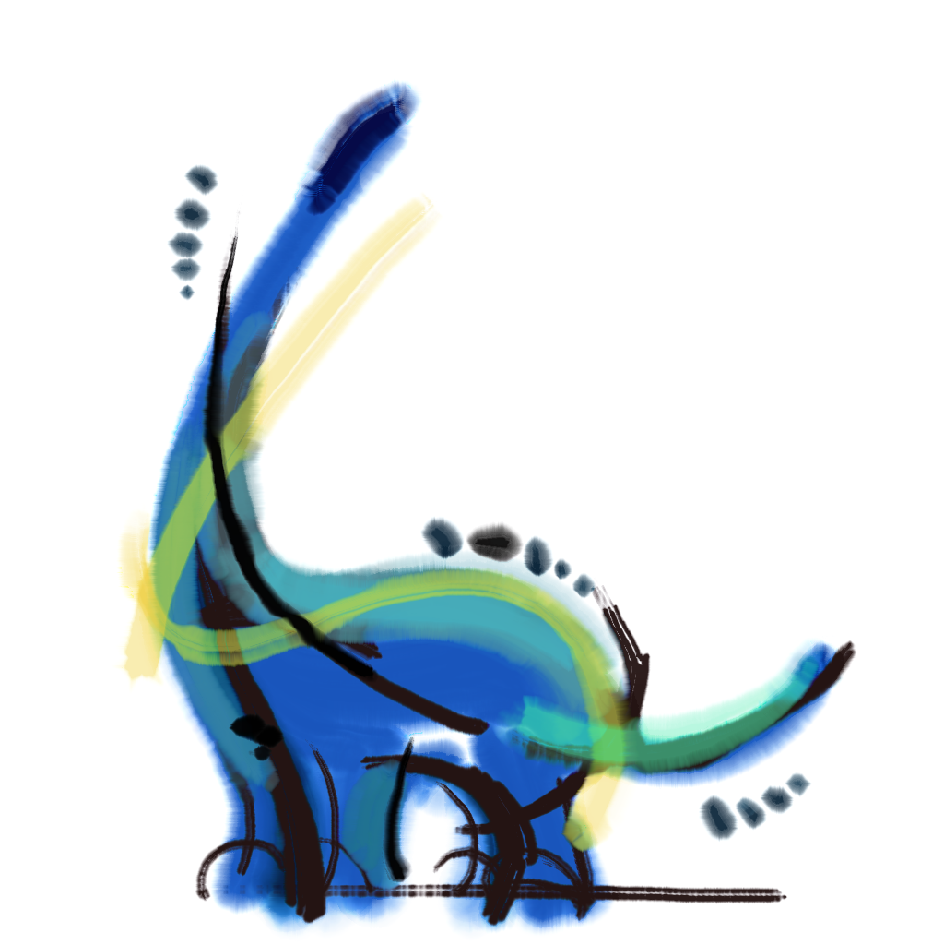

# 水墨水彩画仿真软件的Unity实现

基于格子玻尔兹曼方法的水墨画仿真。由于只是用于实验和复现具体的扩散算法，各方面的交互都做得比较粗糙。

扩散的核心代码见 Assets / Resources / Shaders / FlowModel / d2q9model.hlsl。

实际绘画体感效果：

实验绘画（临摹）作品：

参考文献：

Chu N S H, Tai C L. MoXi: real-time ink dispersion in absorbent paper[C]. ACM Transactions on 
Graphics(TOG). ACM, 2005, 24(3): 504-511.